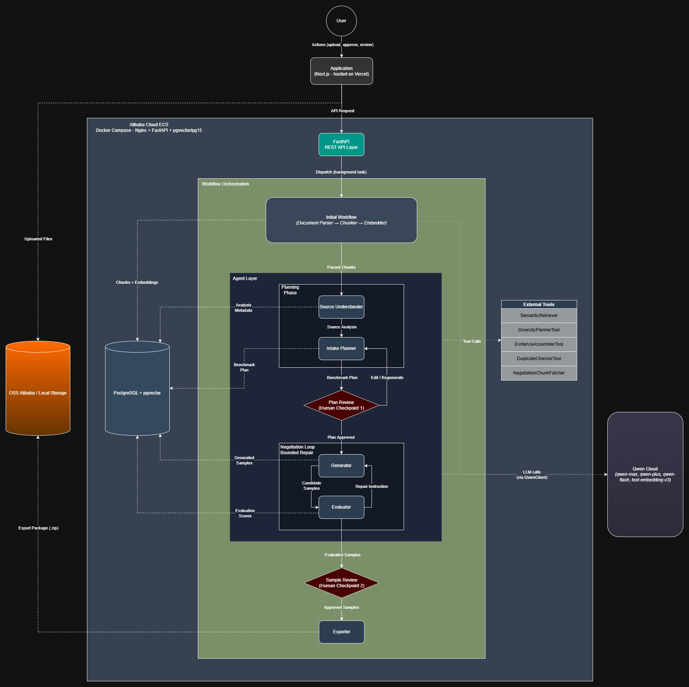

# DatasetOps Autopilot

*DatasetOps Autopilot — turns raw documents and an ambiguous benchmark request into a validated, exportable RAG evaluation dataset, autonomously.*

**Track 4: Autopilot Agent — Global AI Hackathon Series with Qwen Cloud**

[](https://youtu.be/uy2q8OKJU14)

## Problem Statement
Building high-quality RAG benchmarks requires strict grounding in real documents, which is manually exhausting and prone to inconsistencies. Furthermore, user requests are often ambiguous and must be structured prior to generation. This workflow automates the process to turn raw files and vague requirements into structured, reliable evaluation datasets.

## What it does
- Ingests raw documents and ambiguous benchmark requests.
- Analyzes source documents for content density and coverage.
- Generates structured benchmark plans requiring human approval.
- Produces retrieval-grounded evaluation samples across difficulty levels.
- Evaluates samples against quality rubrics with bounded repair retries.
- Routes uncertain samples for human-in-the-loop review.
- Exports validated benchmark packages containing dataset files and reports.

## Architecture


The system spans Frontend, API, Workflow Orchestration, Agent Layer, Qwen Cloud, Storage, and Deployment layers. The FastAPI gateway coordinates a workflow engine with explicit, auditable state transitions, orchestrating five specialized agents through each stage of the pipeline. These agents invoke Qwen Cloud for core reasoning, persisting data and packages to PostgreSQL/OSS.

**Agents:**
- `IntakePlannerAgent` — Transforms vague user requests into structured benchmark plans.
- `SourceUnderstandingAgent` — Evaluates source document density to determine benchmark feasibility.
- `BenchmarkGeneratorAgent` — Synthesizes grounded question-answer pairs from context chunks and processes repairs.
- `QualityEvaluatorAgent` — Assesses samples against quality rubrics and determines routing.
- `ExportReportAgent` — Compiles validated samples and quality reports into the final package.

- **Plan Approval**: Pauses after planning for human verification of categories and difficulty.
- **Sample Review**: Halts after generation to let humans approve or edit individual samples.


## Tech Stack

| Component | Technology |
| :--- | :--- |
| **Frontend** | Next.js, TailwindCSS, TypeScript, Shadcn UI |
| **Backend** | Python, FastAPI, SQLAlchemy, Pydantic, Uvicorn |
| **Database** | PostgreSQL + pgvector (with SQLite fallback for local testing) |
| **LLM** | Qwen Cloud (via DashScope API / OpenAI-compatible client) |
| **Storage** | Alibaba Cloud OSS (with local folder storage fallback) |
| **Deployment** | Backend-only Alibaba Cloud ECS (Docker Compose) + Frontend on Vercel |

## Key Technical Features

- **Generator-Critic Negotiation Loop**: Implements a structured, turn-bounded message exchange between the generator agent (`BenchmarkGeneratorAgent`) and the evaluator agent (`QualityEvaluatorAgent`) to resolve quality issues collaboratively without redundant regeneration.
- **Semantic Embedding Pipeline**: Leverages `text-embedding-v3` embeddings to index source document chunks. The `SemanticRetriever` executes cosine distance search against PostgreSQL to match evidence context to generation requirements, falling back gracefully to naive keyword matching when vector capabilities are absent.
- **RAG Evaluation Metrics**: The evaluation agent grades samples on a 0-1 scale across multiple metrics, including faithfulness (groundedness in source context), answer relevance (addressing the query), context precision, context recall, and hallucination risk.
- **Human-in-the-Loop Checkpoints**: Implements blocking execution states where progress halts until a human approves the drafted benchmark plan or reviews the evaluated samples, ensuring final dataset quality control.
- **Bounded Repair Loop**: Evaluator-rejected samples are automatically routed back to the generator with specific feedback instructions, restricted by a strict quota of maximum 3 repair retries to control LLM cost.

## Local Development Setup

Follow one of the setup options below to run the project locally.

### Option A: Full Docker Compose (mock mode — recommended for quick start)

Runs the entire stack (frontend, backend, database) in Docker with LLM and storage calls mocked locally for quick verification.

```bash
git clone https://github.com/PTD504/datasetops-autopilot.git
cd datasetops-autopilot
cp .env.example .env
# Verify that QWEN_RUN_MODE=mock and STORAGE_MODE=local are set in .env
docker compose up -d --build
```

Access the applications at:
- **Frontend UI**: `http://localhost:3000`
- **Backend API**: `http://localhost:8000`
- **Swagger Docs**: `http://localhost:8000/docs`

### Option B: Full Docker Compose (real Qwen mode)

Runs the entire stack in Docker using real Qwen Cloud API calls. You can choose to run this mode using local storage (default, only requires a Qwen API key) or configure it to upload artifacts directly to Alibaba Cloud Object Storage Service (OSS).

#### Case 1: Real Qwen + Local Storage (Only requires Qwen API Key)

Generated datasets and cards will be saved to your local machine (`backend/storage`).

```bash
# Edit .env and configure the following variables:
# QWEN_RUN_MODE=real
# QWEN_API_KEY=your_actual_qwen_api_key
# STORAGE_MODE=local

docker compose up -d --build
```

#### Case 2: Real Qwen + Real OSS Mode (Requires both Qwen & OSS Credentials)

```bash
# Edit .env and configure the following variables:
# QWEN_RUN_MODE=real
# QWEN_API_KEY=your_actual_qwen_api_key
# STORAGE_MODE=oss
# ALIBABA_CLOUD_ACCESS_KEY_ID=your_access_key_id
# ALIBABA_CLOUD_ACCESS_KEY_SECRET=your_access_key_secret
# ALIBABA_CLOUD_OSS_ENDPOINT=your_oss_endpoint
# ALIBABA_CLOUD_OSS_BUCKET=your_oss_bucket
# ALIBABA_CLOUD_OSS_REGION=your_oss_region

docker compose up -d --build
```

### Option C: Backend-only Docker + Native Frontend (Non-Docker)

Runs the database (and optionally backend) services in Docker, while running the Next.js frontend natively on the host machine.

```bash
# Start the database and backend in Docker
docker compose up -d --build backend

# Start the frontend natively
cd frontend
npm install
npm run dev
```

## Production Deployment

The project is structured with a decoupled, production-ready architecture:

- **Backend (Alibaba Cloud ECS)**:
  - Deployed via `docker-compose.prod.yml` to run the database (`db` using pgvector), the FastAPI API service (`backend`), and Nginx (`nginx`) acting as the single entry point.
  - The Nginx reverse proxy container exposes port `80` to manage incoming traffic for `/api/`, `/docs`, `/openapi.json`, and `/health` (routing them to the backend container).
  - Cross-Origin Resource Sharing (CORS) is secured using the `CORS_ORIGINS` environment variable configured in `.env`.
- **Frontend (Vercel)**:
  - Deployed separately as a serverless static application on Vercel.
  - Connects to the ECS backend gateway using the **`BACKEND_URL`** environment variable (configured in Vercel or `frontend/.env.local`, pointing to `http://<YOUR_ECS_PUBLIC_IP>`).

## Project Structure

```
datasetops-autopilot/
├── backend/                # FastAPI application, agent orchestrator, database models, and pipeline logic
│   ├── agents/             # AI agent definitions (Planner, Generator, Evaluator, etc.)
│   ├── api/                # API routers and endpoints
│   ├── core/               # Configuration, security guardrails, and database setup
│   ├── models/             # Database ORM models (Project, Sample, Plan, etc.)
│   ├── pipeline/           # Document parsing, chunking, and semantic retrieval components
│   ├── schemas/            # Pydantic schemas for request/response validation
│   ├── services/           # Resource limits, budget monitoring, and job control
│   ├── tests/              # Integration and unit tests
│   ├── tools/              # Custom helper tools (duplicate checkers, evidence builders, planning assistants)
│   ├── workflows/          # Background state machine pipelines (generation loop, initial setup, export package)
│   └── wrappers/           # Qwen client compatible with DashScope and Alibaba OSS client
├── deploy/                 # Deployment configurations (Nginx reverse proxy)
├── docs/                   # System architecture and deployment guides
├── frontend/               # Next.js frontend web application code
├── docker-compose.yml      # Compose configuration for local development
└── docker-compose.prod.yml # Production Docker compose configuration
```

## Hackathon Track

**Track 4: Autopilot Agent**  
Submitted to the Qwen Cloud Global Hackathon.
